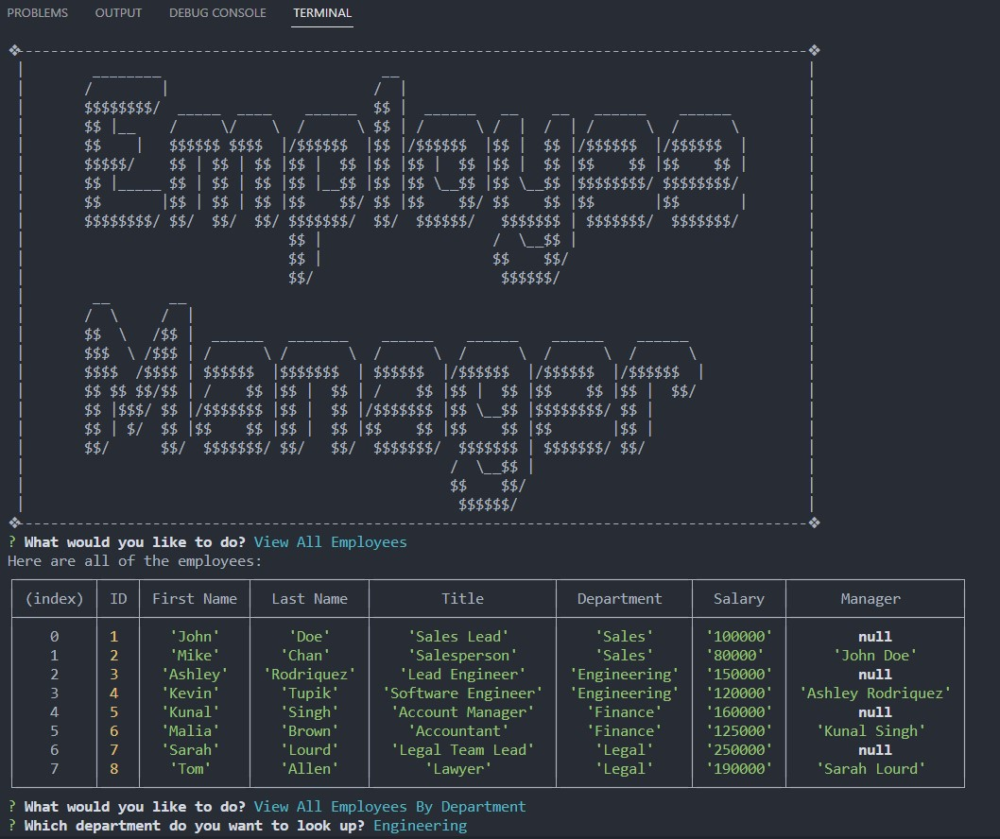
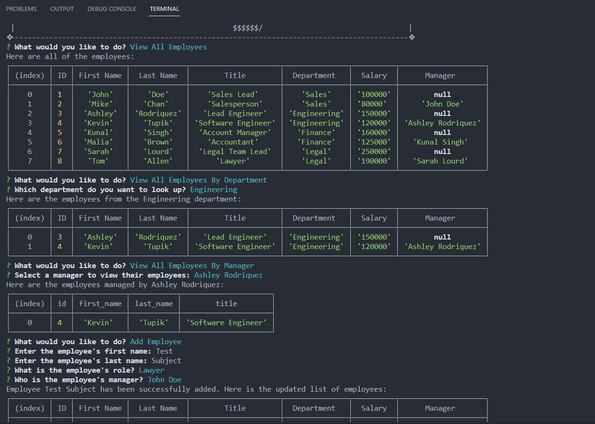
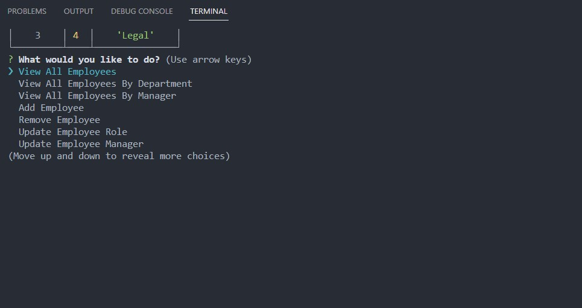

# Employee CLI Tracker

## Description
This command-line application is designed to simplify company management tasks. It is built using JavaScript and utilizes a locally hosted MySQL server to store and retrieve data. The application leverages the power of the mysql2 package for seamless database connectivity and the inquirer package for interactive user prompts.

With this application, users gain access to a wide range of features that streamline company management. They can effortlessly view and manage employees, add or remove employees as needed, access department information, create or delete departments, and much more.

Throughout the development of this project, I gained valuable experience in utilizing MySQL Shell to execute commands effectively. I acquired knowledge on database schema creation and seeding, and I developed a strong understanding of essential CRUD (Create, Read, Update, Delete) operations. Additionally, I became proficient in working with primary and foreign keys to establish and manage relationships between database tables.

By completing this project, I have not only expanded my technical capabilities but also enhanced my understanding of practical database management concepts. This application showcases my proficiency in utilizing JavaScript, MySQL, and related packages to create a robust and user-friendly command-line interface for company management tasks.

## Table of Contents
1. [Installation](#installation)
2. [Usage](#usage)
3. [Credits](#credits)
4. [Questions](#questions)  
5. [License](#license)

## Installation
- Download and install the Node.js LTS version from [Node.js](https://nodejs.org/en).
- Clone the repo using:

        git clone git@github.com:Dinh282/employee-tracker.git

 - Or download the code from https://github.com/Dinh282/employee-tracker.git and
open it with VS Code.       
- Make sure you are in the root path of the project folder and then install dependencies for the project with:

        npm i

- You would also need to download MySQL and start your database. 
- Set up the connection to the database by editing the server.js file. Replace the user and password values with what you use to connect to MySQL.
- You must log in to your MySQL Shell and source the schema.sql and seeds.sql files. You can do so using this command:

        source schema.sql;  
        source seeds.sql;

- After sourcing the schema and seeding your database with sample data, you can now use the app.

## Usage

- Exit MySQL Shell and cd to the root of the project folder.
- Run the application with the following command:

        node server.js

- Explore the application by following the command line prompts.

- Alternatively, you can view the demo video.

---

Video Demo of Application:

 Screenshots of Command Lines:

## Credits:

1. https://www.npmjs.com/package/figlet (Help with logging the app title to terminal.)

2. https://www.knowledgehut.com/blog/web-development/node-js-process-exit (Help with process.exit())

3. https://www.youtube.com/watch?v=p3qvj9hO_Bo&t=1714s (Help with learning SQL)

4. https://www.youtube.com/watch?v=9yeOJ0ZMUYw (Help with joining sql tables.)

5. https://www.scaler.com/topics/javascript/static-methods-in-javascript/ (Help with static functions)

6. https://www.npmjs.com/package/mysql2 (Help with using mysql)

7. https://dev.mysql.com/doc/refman/8.0/en/tutorial.html (Help with installation and setting up MySQL)

8. Instructor, TAs, and classmates.

## Questions
Feel free to contact me at nguyen_dinh282@yahoo.com for additional information.  
Also, check out my other projects on [GitHub](https://github.com/Dinh282)

## License

Please refer to the LICENSE section in the repository.

---